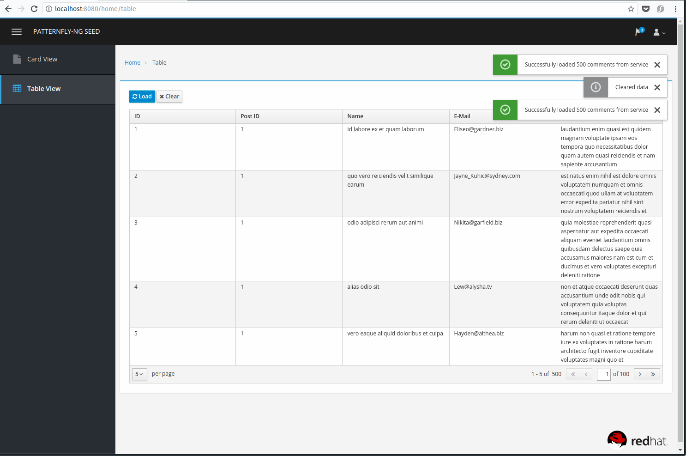

# jboss-client

AngularJS application frontend for a hosted [JBoss EAP7](https://developers.redhat.com/products/eap/download/) REST api.  Works with [jboss-api](https://github.com/mechevarria/jboss-api)

Based on [Patternfly Seed](https://github.com/mechevarria/patternfly-seed)

The SSO branch authenticates against a [Red Hat Single Sign On](https://access.redhat.com/products/red-hat-single-sign-on) local instance

## Build and Run
In the project root directory

~~~bash
npm install

npm run dev
~~~

To do a production build that **concats, minifies and uglifies** Javascript and CSS.

~~~bash
npm run start
~~~  

The completed build will be in the **dist** directory and a server with serve from the directory.  To just do a production build and not server do

~~~bash
npm run build
~~~  

## Editing
* The proxy that allows the querying the api and sso is in
`gulpfile.js`

    * By default the api is on a server `localhost` on port `8080`

    * The single sign on server is by default `localhost` on port `8180`.  This is the port number if running a default SSO server `standalone.sh` 
with the option `--Djboss.socket.binding.port-offset=100`

* The default realm in the `keycloak.json` is **eap-node-realm**

* The file that authenticates against the Red Hat SSO instance, loads the user profile and then loads the Angular application is [bootstrap.js](https://github.com/mechevarria/jboss-client/blob/sso/app/bootstrap.js)
* The auth token, example: `Bearer eyJhbGci...` that is injected into the header of calls against protected Red Hat SSO instances is set in [api-header-service.js](https://github.com/mechevarria/jboss-client/blob/sso/app/components/api/api-header-service.js)
## References
Built using the following libraries

[Keycloak Javascript Adaptor](https://keycloak.gitbooks.io/documentation/content/securing_apps/topics/oidc/javascript-adapter.html)

[PatternFly](http://www.patternfly.org/)

[Angular PatternFly](www.patternfly.org/angular-patternfly/)

[UI Bootstrap](https://angular-ui.github.io/bootstrap/)

